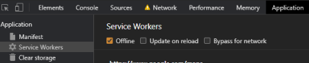

# Budget Tracker
Budget Tracker enables user to add expenses and deposits to their budget. Using IndexDB and Progressive Web Application (PWA), user can perfom the tasks seamlessly with or without a connection.   Without connection, this application will be able to process the transactions and display the correct balance to the user.  Then as connection to the internet happens, the data from the offline transaction will be recorded to the database. 

# User Story
AS AN avid traveller
I WANT to be able to track my withdrawals and deposits with or without a data/internet connection
SO THAT my account balance is accurate when I am traveling.

## Offline Functionality
  * Enter deposits offline
  * Enter expenses offline

## When brought back online:
  * Offline entries should be added to tracker.

# Technology
Back-end: MongoDB, Mongoose, NodeJS and Express.
Front-end: JavaScript, CSS, Chart.js, IndexDB, Manifest and Service Worker

# Installation
## Steps required running the app through __local server__:

To run this application through your local server, first, it needs [MongoDB](https://www.mongodb.com/) and [Robo 3T](https://robomongo.org/download) installed and run.

Then, in the terminal, run __npm install__ to have its dependecy packages installed. After all the neccesary tools are set, the app is ready to run the __server.js__ file in Node environment by typing __npm start__. \
Then after sucessfull connection, the browser can access index.html through localhost connection, in this case, _localhost:3000_. \

### Testing the offline capabilities:

To test the offline capabilities, you can imitate offline state by selecting offline check box option in the Application option inside the Service Worker selection from the browser's devTool. \

## Link to access the application in __Heroku__:

This application is also hosted in Heroku web server. \
Click [Budget Tracker on Heroku](https://young-temple-67562.herokuapp.com/) to access this application.

## CONTRIBUTOR
Front-end base code is provided by UW Fullstack Bootcamp team.

## MAINTAINER 
This is an individual assignment maintained by Carolina Yoedhana.
* GitHub repo: https://github.com/CarolinaYo/budget-tracker.git
* Deployed Heroku link: https://young-temple-67562.herokuapp.com/